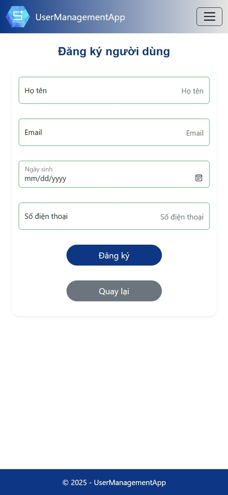

# Webform_DK_QL

Bài tập 1 – Xây dựng Web Form Đăng ký & Quản lý người dùng
<p align="center">
  
  <br/>
  <i>Figure:  Web Form Đăng ký & Quản lý người dùng</i>
</p>


More details at: https://github.com/T-K-Nguyen/Webform_DK_QL

### Features Implemented
1. **User Registration Form**:
   - Fields: FullName, Email, DateOfBirth, PhoneNumber
   - Validation: Required fields, Email format, Phone format
   - Responsive design with Bootstrap 5

2. **User List**:
   - Displays all users in a table
   - Columns: FullName, Email, DateOfBirth, PhoneNumber, Actions (Edit/Delete)
   - Responsive table


3. **Edit User**:
   - Form to update user details
   - Same validations as Create

4. **Delete User**:
   - Confirmation page before deletion

## How to Run Locally
1. **Prerequisites**:
   - Install .NET 9 SDK: https://dotnet.microsoft.com/en-us/download/dotnet/9.0
   - Install EF Core tools: `dotnet tool install --global dotnet-ef`

2. **Steps**:
   - Apply migrations (already applied): `dotnet ef migrations add InitialCreate` and `dotnet ef database update`
```bash
git clone https://github.com/T-K-Nguyen/Webform_DK_QL.git
cd Webform_DK_QL/Webform_DK_QL/
dotnet run
```
### Technologies Used
- **Framework**: .NET 9, ASP.NET Core MVC
- **Database**: SQLite
- **ORM**: Entity Framework Core
- **Frontend**: Bootstrap 5 (CDN)
- **Packages**:
  - Microsoft.EntityFrameworkCore.Sqlite
  - Microsoft.EntityFrameworkCore.Design

### Screenshots

- Home page: friendly UI home
<table>
  <tr>
    <td align="center">
      <br/>
      <i>Home Screen</i>
    </td>
    <td align="center">
      <br/>
      <i>Home Screen (Phone view)</i>
    </td>
    <td align="center">
      <br/>
      <i>Setting in Phone view</i>
    </td>
  </tr>
</table>


- Index page: Shows user list in a table
<table>
  <tr>
    <td align="center">
      <br/>
      <i>List of registered user</i>
    </td>
    <td align="center">
      <br/>
      <i>List of registered user 1 (Phone view)</i>
    </td>
    <td align="center">
      <br/>
      <i>List of registered user 2 (Phone view)</i>
    </td>
  </tr>
</table>


- Register form: Shows pre-filled user data
<table>
  <tr>
    <td align="center">
      <br/>
      <i>Register user</i>
    </td>
    <td align="center">
      <br/>
      <i>Registered user (Phone view)</i>
    </td>
  </tr>
</table>


- Edit form: Shows pre-filled user data
<table>
  <tr>
    <td align="center">
      <br/>
      <i>Editing user info</i>
    </td>
    <td align="center">
      <br/>
      <i>Editing user info (Phone view)</i>
    </td>
  </tr>
</table>


- Delete page: Shows confirmation dialog
<table>
  <tr>
    <td align="center">
      <br/>
      <i>Deleting User</i>
    </td>
    <td align="center">
      <br/>
      <i>Deleting User (Phone view)</i>
    </td>
  </tr>
</table>


### Limitations
- No user authentication (as not required).
- Basic styling; can be enhanced with custom CSS.
- SQLite used for simplicity; can switch to SQL Server LocalDB by updating connection string and package.